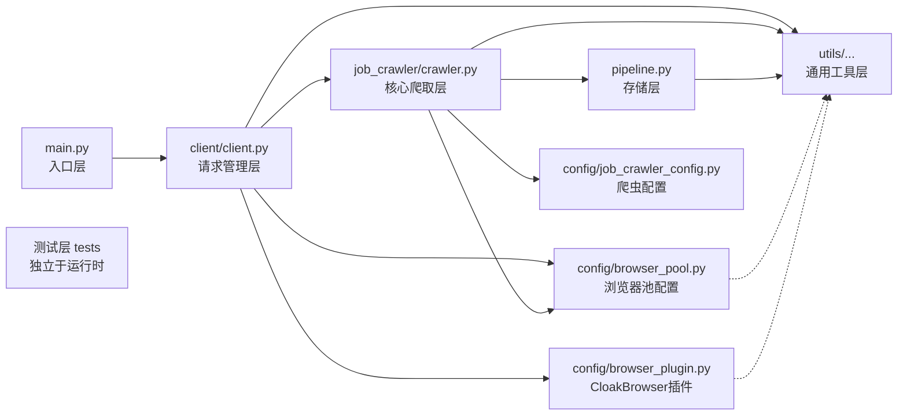

# Recruit Crawler — 系统设计分析

> 本文档是对 `recruit-crawler` 项目的设计思路分析，聚焦于架构决策、反爬策略设计与工程化实践。代码实现细节已脱敏，不包含目标网站信息或可被滥用的具体技术参数。

## 1. 项目背景与目标

- **背景**：商业招聘网站普遍采用反爬风控（指纹检测、行为分析、验证码、IP 封锁等），传统单次请求方式难以稳定获取公开数据
- **目标**：设计一个具备**工程化结构、反检测能力、异常容错机制**的数据采集系统，探索“非破坏性”的数据获取工程实践
- **定位**：技术研究项目，重点探索反爬风控场景下的爬虫工程化设计方案

## 2. 整体架构

### 2.1 模块划分

### 2.2 分层职责

| 层级 | 目录/模块 | 核心职责                                                                                                                                                  |
| :--- | :--- |:------------------------------------------------------------------------------------------------------------------------------------------------------|
| **入口层** | `job_crawler/main.py` | 环境变量加载、组件实例化、依赖注入、爬虫启动                                                                                                                                |
| **请求管理层** | `client/client.py` | 请求生命周期钩子：导航前配置（请求头、临时Cookie、本次导航的开始时间记录）、错误处理（异常分类、重试策略）                                                                                              |
| **核心爬取层** | `job_crawler/crawler.py` | 页面解析（BeautifulSoup）、数据提取、翻页控制、人类行为模拟调度                                                                                                                |
| **存储层** | `job_crawler/pipeline.py` | 数据持久化（CSV 写入）、写入结果验证                                                                                                                                  |
| **通用工具层** | `utils/` | 代理池管理（`proxy.py`）、行为模拟（`behavior.py`）、验证码处理（`captcha.py`）、状态码解析（`http_utils.py`）、日志配置（`logging_config.py`）、装饰器（`decorators.py`）、异常定义（`exceptions.py`） |
| **配置层** | `config/` | 浏览器池定制（`browser_pool.py`）、CloakBrowser 插件（`browser_plugin.py`）、爬虫配置（`job_crawler_config.py`）                                                          |
| **测试层** | `tests/` | 单元测试（工具层部分覆盖、数据持久化等）、Playwright 连通性测试                                                                                                                 |

### 2.3 分层依据

| 设计原则     | 具体体现                                                                                                                    |
|:---------|:------------------------------------------------------------------------------------------------------------------------|
| **依赖方向** | 上层依赖下层。业务主线为 `main.py` → `client/` → `job_crawler/` → `pipeline/`；所有业务层模块（`client/`、`job_crawler/`、`pipeline/`）均依赖 `utils/`；`config/` 由上层注入，其部分组件（`browser_pool.py`、`browser_plugin.py`）在初始化时依赖 `utils/`。整体无循环依赖 |
| **职责集中** | 多数模块职责相对集中（如 `proxy.py` 专注代理映射与生命周期管理，`behavior.py` 专注行为模拟），但部分模块（如 `crawler.py`）因业务复杂度需要承担页面解析、翻页控制、行为模拟调度等多项相关职责，属于合理例外 |
| **依赖传递（混合模式）** | 核心依赖通过构造函数位置参数显式声明（如 `proxy_url`、`headers`），确保关键依赖清晰可见；非核心依赖（如 `logger`）通过 `**kwargs` 传递并提供默认值，兼顾灵活性与容错性               |
| **可测试性** | 工具层与爬虫层分离，不依赖真实网络或浏览器环境的模块（如代理池、状态码解析、参数提取）可独立使用 `unittest.mock` 进行隔离测试，无需启动浏览器或访问外部服务                                  |

## 3. 核心技术策略

### 3.1 代理池管理

- **设计思路**：每个会话绑定独立的代理 IP，确保请求出口的一致性
- **实现要点**：
  - 会话与代理的双向映射，确保绑定关系的唯一性与可追溯性
  - 代理失效时自动补充，并同步清理旧映射，防止内存堆积
- **解决的核心问题**：避免因代理切换导致的身份关联断裂

### 3.2 浏览器指纹伪造

- **设计思路**：从浏览器底层伪造硬件指纹，而非依赖 JS 层的属性覆盖
- **实现要点**：
  - 自定义浏览器插件，替换默认浏览器启动路径
  - 为每个浏览器实例分配随机退役阈值，实现指纹动态轮换
- **解决的核心问题**：避免固定指纹被长期追踪，降低同一指纹在多 IP 间复用的关联风险

### 3.3 人类行为模拟

- **设计思路**：从鼠标轨迹、请求间隔、操作误差三个维度模拟真人行为
- **实现要点**：
  - 鼠标轨迹：三次贝塞尔曲线 + 缓动函数，模拟自然移动与过冲修正
  - 请求间隔：帕累托分布控制，模拟“多数短间隔、少数长间隔”的人类浏览节奏
  - 辅助行为：随机滚动、悬停、无意识微移，补充交互细节
- **解决的核心问题**：降低自动化请求特征的显著性

### 3.4 分层异常处理

- **设计思路**：按异常类型分层处理，执行差异化的恢复策略
- **实现要点**：
  - 异常分层：浏览器进程层 / 网络层 / HTTP 状态码层 / 页面内容层 / 验证码层 / 代理获取层
  - 恢复策略：指数退避 + 随机抖动、代理轮换、浏览器退役
- **解决的核心问题**：单点失败不影响整体任务，提升系统容错性

### 3.5 验证码处理

- **设计思路**：自动检测验证码触发，通过打码平台完成解决
- **实现要点**：
  - 从页面中提取验证码相关参数
  - 支持双打码平台降级
- **解决的核心问题**：减少人工干预，提升无人值守稳定性

## 4. 技术栈选型

| 类别          | 选择                      | 选型理由（简要）                                 |
|:------------|:------------------------|:-----------------------------------------|
| **爬虫框架**    | Crawlee                 | 内置请求队列、浏览器池、会话管理、自动重试，工程化支持相对完善          |
| **浏览器驱动**   | Playwright              | 跨浏览器支持、API 设计友好、与 Crawlee 深度集成           |
| **指纹伪造**    | CloakBrowser            | C++ 源码级伪造，覆盖 Canvas/WebGL/Audio，非 JS 层补丁 |
| **异步 HTTP** | httpx                   | 支持异步、代理、超时控制，接口简洁                        |
| **重试机制**    | tenacity                | 灵活的装饰器式重试，支持指数退避与异常过滤                    |
| **数据解析**    | BeautifulSoup4 + lxml   | 成熟稳定的 HTML 解析方案                          |
| **数据存储**    | Polars                  | 高性能 CSV 读写与数据验证                          |
| **测试框架**    | pytest + pytest-asyncio | 标准异步测试方案，Mock 支持相对完善                     |

## 5. 测试覆盖范围

当前测试主要集中在工具层（utils/），包括：

- 代理池管理（会话绑定、失效标记和补充）
- HTTP 状态码解析（Retry-After 处理、状态码异常分类）
- 人类行为模拟（延时分支、鼠标轨迹）
- 验证码参数提取（正则匹配）
- 日志装饰器（执行时间记录）

非工具层：
- 数据持久化（CSV 写入与验证）
- Playwright 环境连通性（冒烟测试）

## 6. 遇到的挑战与解决方案

| 挑战 | 解决思路                           |
| :--- |:-------------------------------|
| 浏览器指纹被识别 | 采用源码级指纹伪造方案，替代 JS 层补丁；实行指纹动态轮换 |
| 会话-指纹-IP绑定关系断裂被识别 | 将代理、会话和指纹三者绑定，实行动态轮换，失效时同步清理   |
| 非人类行为模式被检测 | 从鼠标轨迹、请求间隔、操作误差三维度模拟真人行为       |
| 异常导致任务中断 | 分层异常处理 + 指数退避重试 + 自动资源轮换       |
| 人机验证拦截 | 自动检测 + 双打码平台降级                 |

## 7. 当前局限性与后续优化方向

| 局限性             | 后续可优化方向                                                             |
|:----------------|:--------------------------------------------------------------------|
| 页面解析依赖固定选择器，结构变化需手动更新 | 引入基于 DOM 相似度或 AI 的自适应解析                                             |
| 指纹库版本固定，UA 单一化  | 升级至更新的指纹库版本                                                         |
| 核心爬取流程未纳入单元测试   | 数据解析层的单元测试（Mock）与爬虫调度流程的本地集成测试（模拟服务器）                               |
| 仅支持 Windows 环境  | 补充 macOS / Linux 环境适配测试                                             |
| 单次任务的资源回收未充分验证  | 在单次任务结束后，检查浏览器进程、临时文件是否被正确释放，确保无资源残留 |

## 8. 总结

本项目展示了一个面向商业级反爬风控的爬虫系统设计方案，核心聚焦于：

- **工程化架构**：模块分层清晰、依赖注入、异常相对体系完整
- **反检测策略**：从指纹伪造、行为模拟到代理管理，形成多层防御
- **可观测性**：结构化日志与指标统计，便于运行状态追踪
- **测试与文档**：核心工具层单元测试覆盖，设计文档补充说明

项目定位为技术研究与工程实践，不涉及对目标网站的破坏性操作或商业数据滥用。所有代码与设计仅为展示高反爬环境下的工程化爬虫设计与解决思路。

## 附录

- **代码仓库**：私有仓库，具体实现细节不公开
- **许可证**：

  © 2026 Drift-bottle. 本仓库内的所有内容，包括但不限于分析文档、代码示例及相关图片，均作为统一的“作品”整体采用 [CC BY-ND 4.0](https://creativecommons.org/licenses/by-nd/4.0/) 许可协议。

  您可以自由地在任何媒介以任何形式复制和分享本作品，包括用于商业目的。但必须遵循以下条件：

  *    **署名** — 您必须给出**适当的署名**。署名应至少包括本作品名称（recruit-crawler-analysis）、作者（Drift-bottle）和来源(https://github.com/Drift-bottle/recruit-crawler-analysis) 。您不得以任何方式暗示许可人为您或您的使用背书。
  *    **禁止演绎** — 您不得修改、转换或者基于本作品进行再创作，并且不得分发修改后的版本。

  完整的许可协议文本请参阅 [LICENSE](LICENSE) 文件。

- **主要参考文档**：Crawlee 官方文档、Playwright API、CloakBrowser 项目文档

> **说明**：本文档为系统设计分析，不包含可复用的具体代码或目标网站信息，仅供技术交流与求职展示使用
